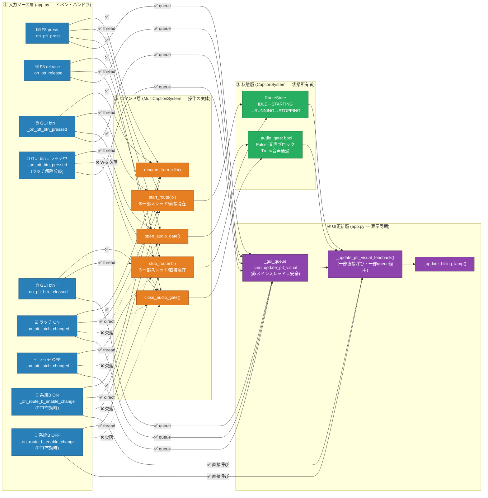
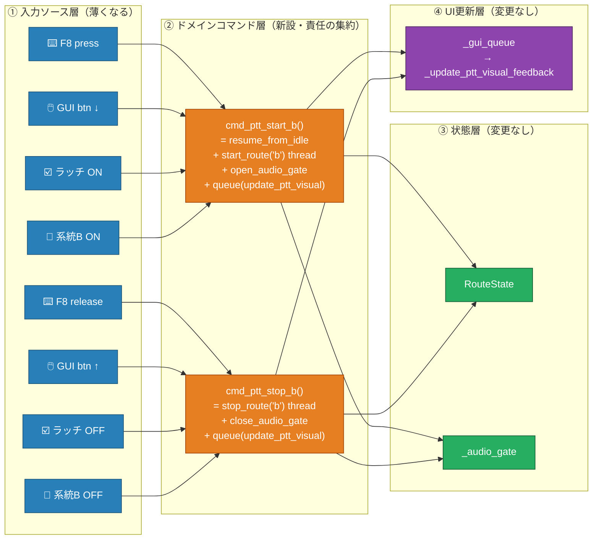

# PTT イベントフロー責任グラフ

生成日: 2026-05-22  
目的: 複数イベントソースのアクション漏れ検出 + オーナーシップ整理

---

## 1. 現状アーキテクチャ（As-Is）



---

## 2. トリガー × アクション 漏れ検出マトリクス

✅ 実装あり　❌ 欠落（バグ）　－ 不要（意味的に無関係）　⚠️ 実装方式が不統一

| イベントトリガー | resume_from_idle | start_route('b') | open_audio_gate | stop_route('b') | close_audio_gate | update_ptt_visual |
|:---|:---:|:---:|:---:|:---:|:---:|:---:|
| F8 press（**基準実装**） | ✅ | ✅ thread | ✅ | - | - | ✅ queue |
| F8 release | - | - | - | ✅ thread | ✅ | ✅ queue |
| GUI btn ↓（通常） | ✅ | ✅ thread | ✅ | - | - | ✅ queue |
| GUI btn ↓（**ラッチ解除**） | - | - | - | ✅ thread | **❌ W-5** | ✅ queue |
| GUI btn ↑ | - | - | - | ✅ thread | ✅ | ✅ queue |
| ラッチ ON | ✅ | ✅ ⚠️direct | **❌** | - | - | ✅ queue |
| ラッチ OFF | - | - | - | ✅ thread | **❌** | ✅ queue |
| 系統B ON（PTT有効） | ✅ | ✅ ⚠️direct | **❌** | - | - | ✅ ⚠️直接 |
| 系統B OFF（PTT有効） | - | - | - | ✅ thread | **❌** | ✅ ⚠️直接 |
| 系統B ON（PTT無効） | - | ✅ ⚠️direct | - | - | - | ✅ ⚠️直接 |
| 系統B OFF（PTT無効） | - | - | - | ✅ ⚠️direct | - | ✅ ⚠️直接 |

**漏れ合計: ❌ 5箇所、⚠️（実装方式不統一）9箇所**

---

## 3. オーナーシップ分析

### 現状の問題

```
【問題の根本】各ハンドラが「何を呼ぶか」を個別に判断している
             → 漏れは「人的ミス」ではなく「構造的必然」

app.py:
  _on_ptt_press()       → resume + start(thread) + open_gate + queue  ← 完全
  _on_ptt_btn_pressed() → resume + start(thread) + open_gate + queue  ← 完全
  _on_ptt_latch_changed(ON) → resume + start(direct)          + queue  ← open_gate 忘れ
  _on_route_b_enable(ON)    → resume + start(direct)          + direct ← open_gate 忘れ
```

### 状態オーナーシップ

| 状態変数 | 所有クラス | 操作権限 | 問題 |
|:---|:---|:---|:---|
| `RouteState` | `CaptionSystem` | `start()` / `stop()` のみ | ✅ 適切 |
| `_audio_gate` | `CaptionSystem` | `open/close_audio_gate()` | ⚠️ 呼出漏れあり |
| `_konnyaku_running` | app.py global | `_on_konnyaku_start_stop_click()` | ⚠️ global変数 |
| `_ptt_enabled` | app.py global | `_on_ptt_enabled_change()` のみのはずが `route_b_enable` も変更 | ❌ 責任分散 |

---

## 4. 改善提案（To-Be）— コマンド層の導入



### 改善効果

- ❌ 5箇所の漏れ → 0（コマンド関数内で完全セットを保証）
- ⚠️ 9箇所の実装方式不統一 → 0（1箇所に集約）
- 新トリガー追加時: コマンド関数を呼ぶだけ（漏れ不可能な構造）
